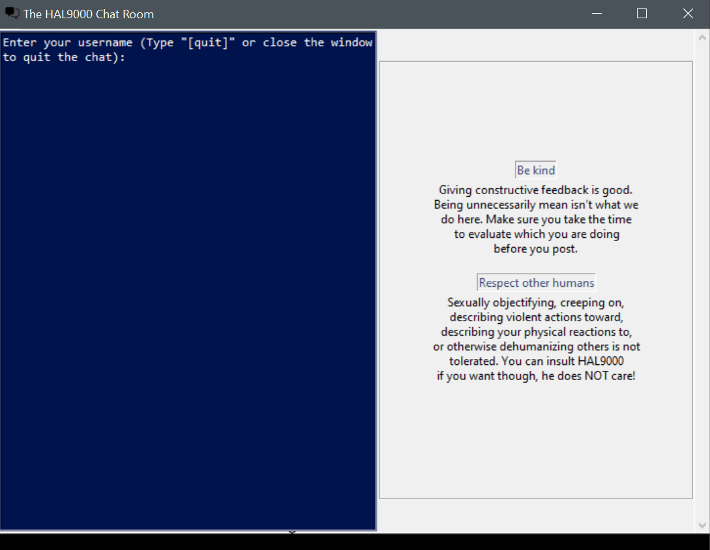

<h1 align="center">

<h4 align="center">A simple chat application!</h4>

</h1>

---

## About

The HAL9000 chat is a chat application that can be used for a *chatroom* or a *1-1 server-client chat*. The server makes use of
the terminal of your choice in both types of chat while the client uses a simple interface.

In the *chatroom* version of the server, it accepts multiple clients allowing them to comunicate. In the *server-client chat* version
the server does not accept more than one client thus, when the comunication ends, to start a new chat it is needed to restart the server.

### Client Interface

<h1 align="center">

<h4 align="center">An example of the client interface</h4>

</h1>

## Requirements

- Python 3.7+
- Pygame

## Installation

Clone or download zip
- Run `pipenv install` in directory to install requirements

## Development setup

- Run `pipenv install --dev` to install dev dependencies

## License

Distributed under the MIT license. See [LICENSE](/LICENSE) for more information.
